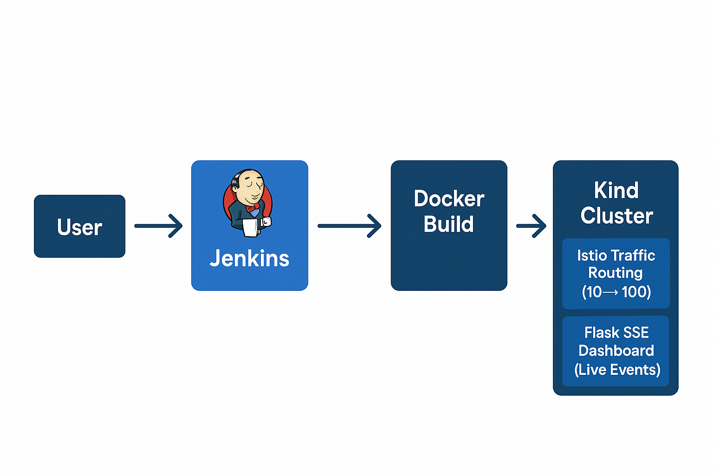
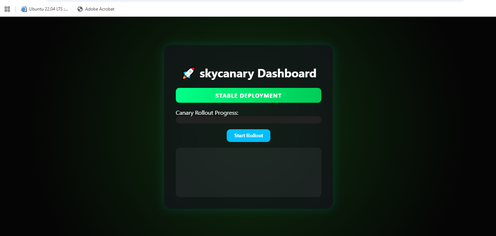
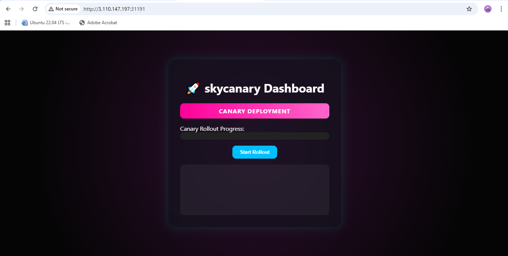

# 🌌 SkyCanary – Intelligent Canary Deployment Pipeline

[](#)
[](#)
[](#)
[](#)
[](LICENSE)

A complete **DevOps project** demonstrating real-world **progressive canary deployments** powered by **Jenkins**, **Kubernetes**, **Istio**, and **Flask**.

---

## 🚀 Key Features

* 🎨 **Dark Neon Dashboard** built in Flask (real-time rollout with SSE)
* ⚙️ **Progressive Traffic Shifting** (10% → 100%) using Istio VirtualService
* 🧩 **Automated Deployments** via Makefile and Jenkins CI/CD
* 🐳 **Dockerized Flask App** with multi-version tagging (`stable`, `latest`)
* ☸️ **Kubernetes + Kind + Istio** setup for local and CI testing

---

## 🧱 Architecture Overview



---

## 🖼️ Canary vs Stable

| Version    | Description                                      | Screenshot                 |
| ---------- | ------------------------------------------------ | -------------------------- |
| **Stable** | The primary version receiving production traffic |  |
| **Canary** | New deployment version receiving partial traffic |  |

---

## ⚙️ Setup Instructions (WSL Ubuntu 22.04+)

### 1️⃣ Bootstrap Your Environment

```bash
sudo ./bootstrap.sh  <Dockerhub-username>
```

Installs everything you need:

* Docker Engine
* Kind, kubectl, helm, istioctl
* Jenkins (LTS)
* Kind cluster + Istio demo profile

Access Jenkins at 👉 **[http://localhost:8080](http://localhost:8080)**

---

### 2️⃣ Build & Deploy SkyCanary

```bash
make build          # Build Flask Docker image
make kind-create    # Create Kind cluster
make kind-load      # Load image into Kind
make deploy         # Deploy to Kubernetes
make rollout        # Shift traffic 10% → 100%
```

---

### 3️⃣ Access the Dashboard

Manually forward traffic from Istio gateway:

```bash
kubectl -n istio-system port-forward svc/istio-ingressgateway 8090:80
```

Then open **[http://localhost:8090](http://localhost:8090)** to view the live SkyCanary dashboard.

---

## 🧠 Local Simulation Mode (No Kubernetes)

Run SkyCanary locally for demo/testing:

```bash
make app-run
```

Then open [http://localhost:8090](http://localhost:8090) → **Start Local Simulation**.

---

## 🧰 Makefile Commands

| Command                    | Description                                                       |
| -------------------------- | ----------------------------------------------------------------- |
| `make kind-create`         | Create Kind cluster, enable Istio injection, and verify setup     |
| `make kind-delete`         | Delete existing Kind cluster                                      |
| `make kind-load`           | Load stable & canary Docker images into Kind nodes                |
| `make deploy`              | Deploy SkyCanary manifests (namespace auto-create + rollout wait) |
| `make access`              | Start background port-forward to access SkyCanary locally         |
| `make stop`                | Stop background port-forward on port 8090                         |
| `make rollout PERCENT=<n>` | Shift canary traffic to `<n>%` via Istio VirtualService           |
| `make promote`             | Promote canary deployment to 100% traffic                         |
| `make rollback`            | Roll back all traffic to stable (0% canary)                       |
| `make destroy`             | Delete the SkyCanary namespace and clean up resources             |


---

## 🧩 Jenkins Pipeline Overview

**Jenkinsfile Stages:**

1️⃣ 🌀 Checkout – Clone repo & fetch commit SHA
2️⃣ 🧩 Docker Build – Build immutable & latest images
3️⃣ 📤 Push to Docker Hub – Push images to Docker registry
4️⃣ ☸️ Base Deployment – Deploy stable & canary to Kubernetes
5️⃣ ⚙️ Canary Rollout – Gradually shift traffic via Istio VirtualService
6️⃣ 🔁 Health Gates – Validate canary health at each step, auto-rollback on fail
7️⃣ 🧠 Promotion – Promote healthy canary → stable & finalize rollout

---

## 🧭 Jenkins Setup Guide

1️⃣ **Unlock Jenkins**

```bash
sudo cat /var/lib/jenkins/secrets/initialAdminPassword
```

2️⃣ **Install Suggested Plugins**
Includes Docker, Git, Pipeline, Kubernetes CLI support.

3️⃣ **Create a Pipeline** → *SkyCanary-Pipeline*

* Definition: *Pipeline script from SCM*
* SCM: *Git*
* Repo: *[https://github.com/gauravchile/SkyCanary.git](https://github.com/gauravchile/SkyCanary.git)*
* Script path: *Jenkinsfile*

4️⃣ **Run the pipeline** → Observe progressive rollout visually 🎉

---

## 🧭 Project Structure

```
SkyCanary/
├── app/
│   ├── app.py                 # Flask SSE app
│   ├── Dockerfile
│   ├── requirements.txt
│   ├── templates/index.html
│   └── static/{css,js}
│
├── kubernetes/
│   ├── kind-config.yaml
│   └── base/
│       ├── deployment.yaml
│       ├── destinationrule.yaml
│       ├── namespace.yaml
│       ├── service.yaml
│       ├── skycanary-gateway.yaml
│       └── virtualservice.yaml
│
├── scripts/
│   ├── bootstrap.sh
│   ├── prerequisites-kind.sh
│   └── check-kind.sh
│
├── Jenkinsfile
├── Makefile
├── docker-compose.yml
└── README.md
```

---

## 🧠 Troubleshooting

| Issue                        | Solution                                                            |
| ---------------------------- | ------------------------------------------------------------------- |
| Jenkins not reachable        | `sudo systemctl status jenkins`                                     |
| Docker permission denied     | `sudo usermod -aG docker jenkins && sudo systemctl restart jenkins` |
| Istio ingress not responding | Ensure namespace labeled `istio-injection=enabled`                  |
| Pod not ready                | `kubectl -n skycanary describe pod <pod>`                           |

---

## 🧩 Next Steps

* 📈 Add Prometheus metrics for automated canary analysis
* 🔔 Integrate GitHub webhooks to trigger Jenkins builds
* 🌐 Expose SkyCanary externally with an Istio Gateway and NodePort service

---

## 🧾 License

Licensed under the **MIT License**. See [LICENSE](LICENSE) for details.

---

**Use SkyCanary to learn, experiment, and demonstrate intelligent canary deployments end-to-end. 🚀**
